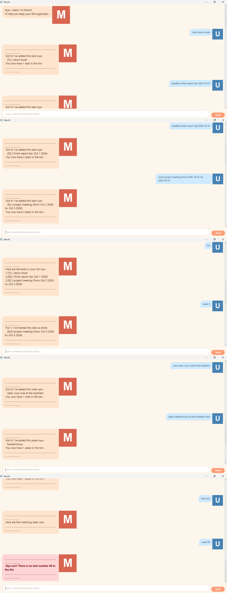

# Mochi User Guide

Mochi is a friendly cat assistant that helps you keep track of your day.
Using Mochi, you can manage **tasks** (todos, deadlines, and events), jot down
**notes**, and keep details about **places** you like. Everything is saved to
your computer automatically, so your data survives restarts.

- [Quick start](#quick-start)
- [Features](#features)
  - [Adding a todo: `todo`](#adding-a-todo-todo)
  - [Adding a deadline: `deadline`](#adding-a-deadline-deadline)
  - [Adding an event: `event`](#adding-an-event-event)
  - [Listing tasks: `list`](#listing-tasks-list)
  - [Marking a task as done: `mark`](#marking-a-task-as-done-mark)
  - [Marking a task as not done: `unmark`](#marking-a-task-as-not-done-unmark)
  - [Deleting a task: `delete`](#deleting-a-task-delete)
  - [Finding tasks: `find`](#finding-tasks-find)
  - [Adding a note: `note`](#adding-a-note-note)
  - [Listing notes: `notes`](#listing-notes-notes)
  - [Deleting a note: `delete-note`](#deleting-a-note-delete-note)
  - [Finding notes: `find-note`](#finding-notes-find-note)
  - [Adding a place: `place`](#adding-a-place-place)
  - [Listing places: `places`](#listing-places-places)
  - [Viewing a place: `view-place`](#viewing-a-place-view-place)
  - [Deleting a place: `delete-place`](#deleting-a-place-delete-place)
  - [Finding places: `find-place`](#finding-places-find-place)
  - [Exiting the app: `bye`](#exiting-the-app-bye)
- [Command summary](#command-summary)

---

## Quick start

1. Ensure you have **Java 25** installed on your computer.
2. Download the latest release of **Mochi** (an executable `.jar` file).
3. Double-click the downloaded file, or run `java -jar mochi.jar` in a terminal.
4. The Mochi window opens. Type a command and press `Enter` (or click the
   **Send** button), and Mochi will reply.
5. Refer to the [Features](#features) below for the full list of commands.
6. Type `bye` (or close the window) to exit. Your data is saved automatically.

> **Tip:** you can type `list`, `notes`, or `places` at any time to see what
> you have stored so far.

---

## Features

Notes about command format:

- Words in `UPPER_CASE` are values you supply, e.g., in `todo DESCRIPTION`,
  `DESCRIPTION` can be `read another book`.
- Dates use the format `yyyy-mm-dd`, e.g., `2019-10-15`.
- Extra spaces between words are allowed; Mochi tidies them up before reacting.

### Adding a todo: `todo`

Adds a task with no date attached.

Format: `todo DESCRIPTION`

Example: `todo return book`

Mochi replies with the added task and the number of tasks you now have.

### Adding a deadline: `deadline`

Adds a task that must be done by a specific date.

Format: `deadline DESCRIPTION /by DATE`

Example: `deadline return book /by 2019-12-02`

The date may be given as `yyyy-mm-dd` (e.g., `2019-12-02`) or as any free text
(e.g., `Sunday`) that Mochi simply remembers. Dates given in `yyyy-mm-dd` are
displayed in a friendlier format, e.g., `Dec 2 2019`.

### Adding an event: `event`

Adds an event that happens between a start and an end time.

Format: `event DESCRIPTION /from START /to END`

Example: `event project meeting /from 2019-10-15 /to 2019-10-16`

If both times are dates in `yyyy-mm-dd`, Mochi checks that the event does not
end before it starts.

### Listing tasks: `list`

Shows all tasks in your list, in the order they were added.

Format: `list`

### Marking a task as done: `mark`

Marks the task at the given number as done.

Format: `mark INDEX`

Example: `mark 2`

### Marking a task as not done: `unmark`

Marks the task at the given number as not done.

Format: `unmark INDEX`

Example: `unmark 2`

### Deleting a task: `delete`

Deletes the task at the given number. The remaining tasks keep their order and
are renumbered, so `list` always shows a contiguous `1.` to `N.` numbering.

Format: `delete INDEX`

Example: `delete 3`

### Finding tasks: `find`

Finds all tasks whose description contains the given keyword.

Format: `find KEYWORD`

Example: `find book`

### Adding a note: `note`

Adds a free-form note, e.g., a reminder or a piece of information. Notes are
stored independently of tasks.

Format: `note CONTENT`

Example: `note waist size is 32`

### Listing notes: `notes`

Shows all notes, in the order they were added.

Format: `notes`

### Deleting a note: `delete-note`

Deletes the note at the given number.

Format: `delete-note INDEX`

Example: `delete-note 2`

### Finding notes: `find-note`

Finds all notes that contain the given keyword.

Format: `find-note KEYWORD`

Example: `find-note milk`

### Adding a place: `place`

Adds a place (e.g., a cafe you like) together with a detail about it. A place
name must be unique: Mochi refuses to add a second place with the same name.

Format: `place NAME /d DETAIL`

Example: `place hawkerlicious /d the hokkien mee is great`

### Listing places: `places`

Shows all places, in the order they were added.

Format: `places`

### Viewing a place: `view-place`

Shows all the details recorded about the place at the given number.

Format: `view-place INDEX`

Example: `view-place 2`

### Deleting a place: `delete-place`

Deletes the place at the given number.

Format: `delete-place INDEX`

Example: `delete-place 3`

### Finding places: `find-place`

Finds all places whose name or detail contains the given keyword.

Format: `find-place KEYWORD`

Example: `find-place wifi`

### Exiting the app: `bye`

Says goodbye and closes the app.

Format: `bye`

---

## Command summary

| Command      | Format                                         | Example                                        |
| ------------ | ---------------------------------------------- | ---------------------------------------------- |
| `todo`       | `todo DESCRIPTION`                             | `todo return book`                             |
| `deadline`   | `deadline DESCRIPTION /by DATE`                | `deadline return book /by 2019-12-02`          |
| `event`      | `event DESCRIPTION /from START /to END`        | `event meeting /from 2019-10-15 /to 2019-10-16` |
| `list`       | `list`                                         | `list`                                         |
| `mark`       | `mark INDEX`                                   | `mark 2`                                       |
| `unmark`     | `unmark INDEX`                                 | `unmark 2`                                     |
| `delete`     | `delete INDEX`                                 | `delete 3`                                     |
| `find`       | `find KEYWORD`                                 | `find book`                                    |
| `note`       | `note CONTENT`                                 | `note waist size is 32`                        |
| `notes`      | `notes`                                        | `notes`                                        |
| `delete-note`| `delete-note INDEX`                            | `delete-note 2`                                |
| `find-note`  | `find-note KEYWORD`                            | `find-note milk`                               |
| `place`      | `place NAME /d DETAIL`                         | `place hawkerlicious /d the hokkien mee is great` |
| `places`     | `places`                                       | `places`                                       |
| `view-place` | `view-place INDEX`                             | `view-place 2`                                 |
| `delete-place`| `delete-place INDEX`                           | `delete-place 3`                               |
| `find-place` | `find-place KEYWORD`                           | `find-place wifi`                              |
| `bye`        | `bye`                                          | `bye`                                          |

## Data storage

Mochi saves your data automatically in a `data` folder next to the app:

- `data/tasks.txt` stores your tasks.
- `data/notes.txt` stores your notes.
- `data/places.txt` stores your places.

The files are plain text, so you can back them up by copying the `data` folder.
If a line in a data file is corrupted, Mochi skips it instead of crashing, so
you can always start Mochi even if a previous session ended badly.